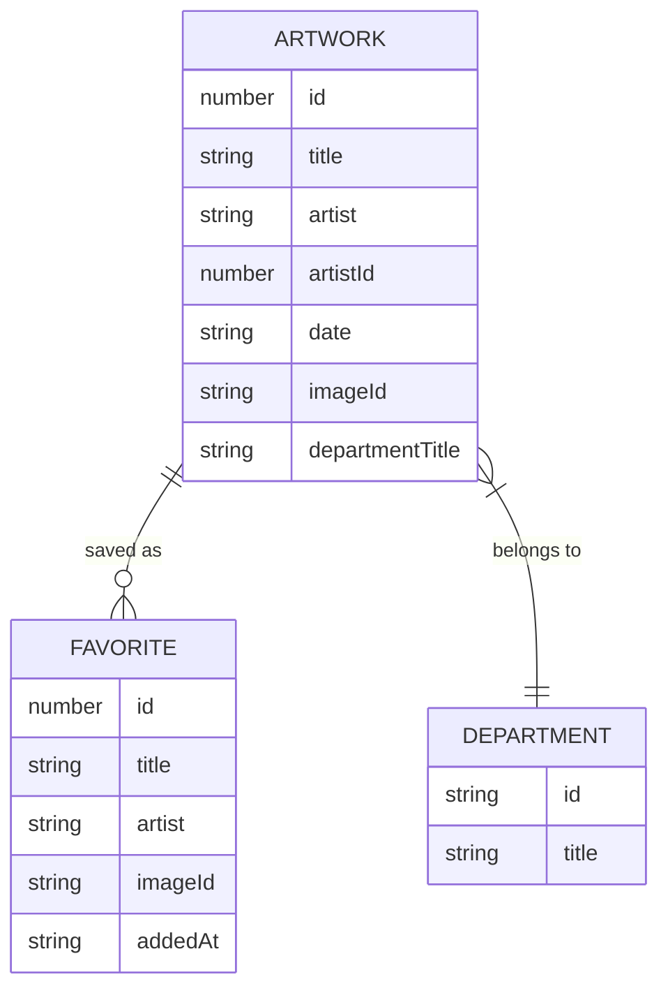

# Spec: Internal Data Model

## Purpose
Define the shape of the primary objects used across the Chicago Museum app. All data coming from the API is normalized through `api.js` into these shapes before reaching UI code.

## Artwork

```js
{
  id: number,               // Art Institute API artwork id
  title: string,
  artist: string,           // artist_display from API
  artistId: number | null,  // for related-works queries
  date: string,             // date_display, e.g., "1888"
  dateStart: number | null,
  dateEnd: number | null,
  medium: string,           // medium_display
  dimensions: string,
  placeOfOrigin: string,
  creditLine: string,
  description: string,      // API-provided HTML; caller sanitizes before injecting
  imageId: string | null,   // IIIF image identifier; null if no public image
  departmentTitle: string | null,
}
```

## SearchResult

```js
{
  items: Artwork[],
  pagination: {
    total: number,
    page: number,
    totalPages: number,
  },
  aggregates: {
    artists: string[],       // distinct artist_display values in this page
    departments: string[],   // distinct department_title values in this page
  }
}
```

## Department (for filter dropdown)

```js
{
  id: string,
  title: string,
}
```

## Favorite (stored in localStorage)

```js
{
  id: number,         // same as Artwork.id
  title: string,
  artist: string,
  imageId: string | null,
  addedAt: string,    // ISO 8601, e.g., "2026-04-19T10:15:00.000Z"
}
```

See `spec-favorites-storage.md` for the full storage schema.

## ERD (conceptual)



## Conventions

- IDs are numbers as returned by the API; keep as numbers in memory and stringify only at URL boundaries.
- Optional API fields that are missing or `null` are stored as `null` (never undefined) after normalization.
- Dates from the API vary in format; the `date` string is kept as-is for display. Numeric filters use `dateStart` / `dateEnd`.
