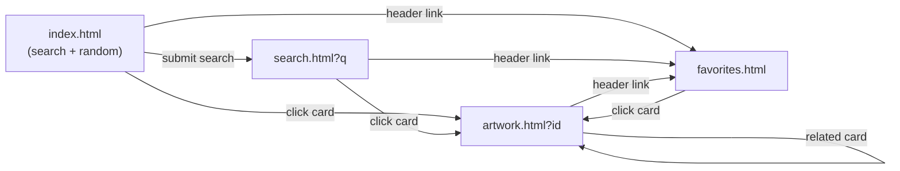

# Spec: Pages and Interactions

## Purpose
Describe page-level structure and user interactions that are not captured by individual FR files. Acts as the glue document between requirements and wireframes.

## Common Shell

Every page includes:
- A site header (`ui/header.js`):
  - Logo / site name — links to `index.html`
  - Search input (reuses main search form, pre-filled from current URL's `q` when applicable)
  - "Favorites" link to `favorites.html`
- A `<main>` region with page-specific content.
- A minimal footer (credit to Art Institute of Chicago with link to the source page for the current artwork if applicable).

## index.html (Home)

Sections (top to bottom):
1. Hero: large centered search input with a brand tagline.
2. Random gallery: 12 cards in a responsive grid (FR-03).

State transitions:
- Loading: skeleton grid.
- Error: message + "Try again" button.
- Ready: cards rendered.

Interactions:
- Search submit → navigate to `search.html?q=…`.
- Card click → navigate to `artwork.html?id=…`.
- ♥ button on card → toggle localStorage (FR-07).

## search.html (Results)

Layout: filter sidebar on the left (≥ lg), 1/3/4 column card grid on the right.

Reads from URL: `q`, optional `artist`, `dateStart`, `dateEnd`, `dept`.

Sections:
1. Header shows the current keyword as `Results for "<q>"`.
2. Filter sidebar: artist list (from result aggregates), period inputs, department dropdown.
3. Card grid: paginated (Load more or numbered pages — pick one in implementation; MVP uses "Load more").

Empty state: friendly message suggesting to refine the query.

## artwork.html (Detail)

Reads `id` from URL.

Layout:
- Top section: image on the left, metadata on the right (stacks on mobile).
- Metadata list shows: title, artist, date, medium, dimensions, place of origin, credit line.
- Description block below the top section (sanitized HTML).
- "View in high-res" button beneath the image.
- Related works section at the bottom (FR-05).

Modal: deep-zoom viewer (FR-06).

## favorites.html (Saved)

Reads from `localStorage`.

Sections:
1. Header: "Your Favorites".
2. Card grid of saved items, sorted by `addedAt` descending.
3. Each card has ♥ (filled) — clicking removes and re-renders the grid.

Empty state: "You haven't saved anything yet." + link back to home.

## Navigation Map

